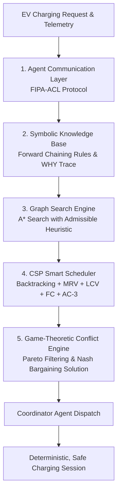

# Intelligent EV Charging & Resource Management System
## Complete File Structure & Technical System Specifications Document

> **System Classification**: Classical Artificial Intelligence & Game-Theoretic Multi-Agent Microgrid Platform  
> **Core Methodology**: Multi-Agent System (FIPA-ACL) • A* Heuristic Search • First-Order Logic Inference • Backtracking CSP (MRV/LCV/AC-3/FC) • Nash Bargaining Game Theory  
> **Data Infrastructure**: Offline verified Pan-India station dataset (72 metro charging hubs) + Discrete-Event Simulation Telemetry  
> **Strict Architectural Guarantee**: 100% Classical Symbolic AI (Zero Neural Networks, Zero Deep Learning, Zero LLMs/Generative Models)  
> **Network Dependencies**: None at runtime. The system makes no outbound third-party API calls; the only external asset is the Leaflet basemap tile layer rendered client-side.  
> **Test Suite**: 124 Automated Tests Passing (`124 passed`)

---

## Table of Contents
1. [Total File Structure & Codebase Directory Tree](#1-total-file-structure--codebase-directory-tree)
2. [Deep-Dive Directory & Component Inventory](#2-deep-dive-directory--component-inventory)
3. [Project Overview & Problem Statement](#3-project-overview--problem-statement)
4. [PEAS Environment Specification](#4-peas-environment-specification)
5. [The 5 Classical AI Engines & Algorithmic Formulations](#5-the-5-classical-ai-engines--algorithmic-formulations)
   - [5.1 Multi-Agent System (MAS) & FIPA-ACL Protocol](#51-multi-agent-system-mas--fipa-acl-protocol)
   - [5.2 Knowledge Base & First-Order Symbolic Inference Engine](#52-knowledge-base--first-order-symbolic-inference-engine)
   - [5.3 Classical Graph Search & Heuristic Route Selection (A* Search)](#53-classical-graph-search--heuristic-route-selection-a-search)
   - [5.4 Backtracking Constraint Satisfaction Problem (CSP) Scheduler](#54-backtracking-constraint-satisfaction-problem-csp-scheduler)
   - [5.5 Game-Theoretic Multi-Agent Conflict Resolution (Nash Bargaining)](#55-game-theoretic-multi-agent-conflict-resolution-nash-bargaining)
6. [Real-World Geographic Datasets & Data Honesty](#6-real-world-geographic-datasets--data-honesty)
7. [Dynamic Stress Scenarios & Fault Resilience](#7-dynamic-stress-scenarios--fault-resilience)
8. [Comparative Benchmark Results & Empirical Evaluation](#8-comparative-benchmark-results--empirical-evaluation)
9. [Complete REST API Reference (FastAPI)](#9-complete-rest-api-reference-fastapi)
10. [Frontend Architecture & The 11 Operational UI Views](#10-frontend-architecture--the-11-operational-ui-views)
11. [AI Syllabus Mapping (Units I–V) & Viva Guide](#11-ai-syllabus-mapping-units-iv--viva-guide)
12. [Installation, Setup, Testing & Execution Guide](#12-installation-setup-testing--execution-guide)

---

## 1. Total File Structure & Codebase Directory Tree

Below is the complete, exhaustive file tree of the entire project repository, excluding temporary build caches and virtual environments:

```text
Intelligent EV Charging & Resource Management System/
│
├── .gitignore                                      # Git ignore rules (node_modules, venv, caches, env files)
├── DOCUMENTATION.md                                # Comprehensive technical engineering documentation
├── Intelligent_EV_Charging_System_Documentation.docx # Pre-compiled executive Word report
├── README.md                                       # Main repository README with quickstart & badge metrics
├── PROJECT_FILE_STRUCTURE_AND_SYSTEM_DETAILS.md   # This comprehensive file structure & details document
├── start.bat                                       # Windows Batch script to launch backend & frontend concurrently
├── start.ps1                                       # PowerShell launch automation script
│
├── backend/                                        # FastAPI Python Classical AI & Simulation Backend
│   ├── .env                                        # Optional local environment overrides (git-ignored; not required to run)
│   ├── .env.example                                # Environment template — no variables are required by the backend
│   ├── requirements.txt                            # Python dependencies (fastapi, uvicorn, pydantic, pytest, httpx)
│   ├── run.py                                      # Dedicated backend launcher script (starts Uvicorn on port 8000)
│   │
│   ├── app/                                        # Core application package
│   │   ├── __init__.py                             # Backend package initializer
│   │   ├── main.py                                 # FastAPI application entrypoint, CORS setup & route mounting
│   │   │
│   │   ├── agents/                                 # FIPA-ACL Multi-Agent Architecture
│   │   │   ├── __init__.py                         # Agents package initializer
│   │   │   ├── base_agent.py                       # Abstract base agent class with message queues & lifecycle loops
│   │   │   ├── ev_agent.py                         # EV Agent: battery state tracking, deadline monitoring & bidding
│   │   │   ├── station_agent.py                    # Station Agent: bay management, queue tracking & power distribution
│   │   │   ├── grid_agent.py                       # Grid Agent: transformer thermal load monitoring & overload alerts
│   │   │   ├── energy_agent.py                     # Energy Agent: solar PV generation tracking & renewable dispatch
│   │   │   ├── coordinator_agent.py                # Coordinator Agent: global scheduling orchestrator & facilitator
│   │   │   └── message_broker.py                   # Central FIPA-ACL message dispatcher & conversation audit logger
│   │   │
│   │   ├── api/                                    # REST API Router & Request Handlers
│   │   │   └── routes.py                           # All API endpoints (/api/state, /api/search, /api/csp, /api/workflow...)
│   │   │
│   │   ├── core/                                   # System Core Foundations
│   │   │   ├── __init__.py                         # Core package initializer
│   │   │   ├── peas.py                             # PEAS framework implementation & metric tracking models
│   │   │   ├── pipeline.py                         # End-to-end decision pipeline chaining formulation, search & CSP
│   │   │   └── workflow.py                         # 8-step primary workflow engine derived from live simulation state
│   │   │
│   │   ├── explanation/                            # Explainable AI (XAI) Decision Traces
│   │   │   ├── __init__.py                         # Explanation package initializer
│   │   │   └── service.py                          # Builds auditable step-by-step traces of why a decision was made
│   │   │
│   │   ├── csp/                                    # Constraint Satisfaction Problem (CSP) Scheduler
│   │   │   ├── __init__.py                         # CSP package initializer
│   │   │   ├── variables.py                        # CSP variables, assignment tuples, domains, and problem state
│   │   │   ├── constraints.py                      # The 8 hard physical, electrical, and temporal constraints
│   │   │   ├── solver.py                           # Backtracking CSP solver with MRV, LCV, FC, and AC-3 algorithms
│   │   │   ├── scenarios.py                        # Preset CSP benchmark scenarios (Normal, Shortage, Overload...)
│   │   │   └── evaluator.py                        # Constraint violation diagnostics and state evaluators
│   │   │
│   │   ├── evaluation/                             # System Benchmarking & Comparative Evaluation
│   │   │   ├── __init__.py                         # Evaluation package initializer
│   │   │   └── benchmark.py                        # Benchmark runner comparing Proposed AI vs 3 baselines (FCFS, Nearest, Priority)
│   │   │
│   │   ├── game_theory/                            # Game-Theoretic Multi-Agent Conflict Resolution
│   │   │   ├── __init__.py                         # Game theory package initializer
│   │   │   ├── utility_models.py                   # Mathematical utility functions (EV, Station, Grid, Solar) & threat points
│   │   │   ├── alternatives.py                     # Candidate deal package generators (5 distinct negotiation deals)
│   │   │   ├── negotiation.py                      # 7-step Nash Bargaining protocol engine & Pareto filter
│   │   │   ├── scenarios.py                        # Contention scenarios (Immediate vs Overload, Solar vs Wait...)
│   │   │   ├── adversarial.py                      # Adversarial multi-round grid/fleet game state & payoff evaluation
│   │   │   └── slot_competition.py                 # Two-agent Minimax with Alpha-Beta pruning over charger bay allocation
│   │   │
│   │   ├── knowledge/                              # Symbolic Knowledge Base & First-Order Logic (FOL)
│   │   │   ├── __init__.py                         # Knowledge package initializer
│   │   │   ├── fact_base.py                        # Dynamic triple store (Subject, Predicate, Value) with indexed queries
│   │   │   ├── rule.py                             # Declarative production rule model with condition evaluator
│   │   │   ├── kb.py                               # Knowledge base registry, simulation synchronization & rule catalog
│   │   │   ├── inference_engine.py                 # Rete-like forward chaining deduction loop & WHY explanation proofs
│   │   │   ├── propositional_dpll.py               # DPLL satisfiability solver with unit propagation & pure symbol elimination
│   │   │   └── resolution.py                       # Propositional resolution refutation theorem prover (CNF, empty clause)
│   │   │
│   │   ├── models/                                 # Domain Schemas & Pydantic Data Models
│   │   │   ├── ev.py                               # EV schema: battery capacity, SoC %, charging rate, deadlines, priority
│   │   │   ├── station.py                          # Station schema: coordinates, chargers, pricing, operating status
│   │   │   ├── charger.py                          # Physical charger schema: connector types (CCS2, Type 2), max kW, status
│   │   │   ├── grid.py                             # Microgrid schema: transformer load, baseline demand, thermal limits
│   │   │   ├── energy_resource.py                  # Energy resource schema: solar array output, battery storage state
│   │   │   └── session.py                          # Active charging session telemetry and metering
│   │   │
│   │   ├── optimization/                           # Local Search & Iterative Improvement
│   │   │   ├── __init__.py                         # Optimization package initializer
│   │   │   └── local_search.py                     # Hill climbing / simulated annealing schedule refinement
│   │   │
│   │   ├── problem/                                # Formal Problem Formulation Layer
│   │   │   ├── __init__.py                         # Problem package initializer
│   │   │   └── formulation.py                      # Translates an EV request into formal search & CSP problem definitions
│   │   │
│   │   ├── scenarios/                              # Dynamic Stress-Testing Scenario Engine
│   │   │   ├── __init__.py                         # Scenarios package initializer
│   │   │   └── scenario_engine.py                  # Handlers for 5 disturbance events (Peak Spike, Station Fault, Grid Overload...)
│   │   │
│   │   ├── search/                                 # Classical AI Graph Search & Route Optimization
│   │   │   ├── __init__.py                         # Search package initializer
│   │   │   ├── graph.py                            # Road network graph: nodes (stations/waypoints), weighted edges, coordinates
│   │   │   ├── heuristics.py                       # Admissible Euclidean distance h(n) & multi-objective domain heuristic
│   │   │   ├── algorithms.py                       # Pure Python implementations: BFS, DFS, UCS, GBFS, A* Search
│   │   │   ├── problem.py                          # Search problem formulation: start state, goal test, transition model
│   │   │   ├── station_selector.py                 # Station ranking engine executing algorithm comparisons & metrics
│   │   │   ├── and_or_search.py                    # AND-OR graph search producing contingency plans for nondeterministic outcomes
│   │   │   ├── belief_search.py                    # Belief-state search over partially observable station telemetry
│   │   │   └── online_search.py                    # LRTA* online search agent interleaving sensing and movement
│   │   │
│   │   ├── services/                               # Offline Station Dataset
│   │   │   └── custom_station_dataset.py           # Offline verified database of 72 Indian EV charging hubs
│   │   │
│   │   └── simulation/                             # Discrete-Event Telemetry & State Engine
│   │       └── engine.py                           # Master simulation clock, arrival generator, state machine, and tick loops
│   │
│   ├── scripts/                                    # Verification & Diagnostic Utilities
│   │   └── verify_all_algorithms.py                # Standalone CLI script testing all 5 classical AI algorithms
│   │
│   └── tests/                                      # Automated Pytest Test Suite (124 Tests)
│       ├── test_adversarial.py                     # Verifies adversarial game state transitions and payoff evaluation
│       ├── test_agents.py                          # Verifies FIPA-ACL dispatch, message queues, and agent state loops
│       ├── test_and_or_search.py                   # Verifies AND-OR contingency plan construction and cyclic-state handling
│       ├── test_audit_regressions.py               # Guards the honesty audit: route dedup, live-state workflow, removed endpoints
│       ├── test_belief_search.py                   # Verifies belief-state transitions under partial observability
│       ├── test_csp.py                             # Verifies CSP backtracking, 8 hard constraints, AC-3, and zero overlaps
│       ├── test_evaluation.py                      # Verifies comparative benchmark metrics against FCFS, Nearest, Priority
│       ├── test_foai_api_endpoints.py              # Verifies the FOAI syllabus REST endpoints respond with valid schemas
│       ├── test_game_theory.py                     # Verifies utility calculations, Pareto dominance, and Nash Bargaining
│       ├── test_local_search.py                    # Verifies hill climbing / simulated annealing cost improvement
│       ├── test_logic_reasoning.py                 # Verifies forward chaining deduction loop and WHY explanation proofs
│       ├── test_new_api_endpoints.py               # Verifies pipeline, explanation, and problem formulation endpoints
│       ├── test_online_search.py                   # Verifies LRTA* step-by-step online navigation and cost learning
│       ├── test_pipeline.py                        # Verifies the end-to-end decision pipeline composition
│       ├── test_propositional_dpll.py              # Verifies DPLL satisfiability, unit propagation, and pure symbols
│       ├── test_resolution.py                      # Verifies resolution refutation proofs and empty-clause derivation
│       ├── test_scenarios.py                       # Verifies dynamic disturbance event execution and fault recovery
│       ├── test_search.py                          # Verifies BFS, DFS, UCS, GBFS, A* optimality, and heuristic admissibility
│       ├── test_simulation.py                      # Verifies multi-tick discrete event simulation, queues, and battery models
│       ├── test_slot_competition.py                # Verifies Minimax / Alpha-Beta equivalence and pruning counts
│       └── test_workflow.py                        # Verifies the 8-step workflow stays consistent with live simulation state
│
├── frontend/                                       # Vite + React Modern Web Telemetry Dashboard
│   ├── .env.example                                # Frontend environment template (Vite API backend proxy)
│   ├── index.html                                  # HTML5 entrypoint with Google Fonts (Outfit, Inter, JetBrains Mono)
│   ├── package.json                                # NPM package manifests (react, leaflet, lucide-react, tailwindcss)
│   ├── package-lock.json                           # Dependency lockfile
│   ├── postcss.config.js                           # PostCSS processor configuration
│   ├── tailwind.config.js                          # Custom Tailwind design tokens (electric blues, pitch darks, glass shadows)
│   ├── vite.config.js                              # Vite build tool and development server configuration with /api proxy
│   │
│   ├── public/                                     # Static Public Assets
│   │   ├── ev_charge_bg.png                        # Hero station graphic
│   │   └── favicon.svg                             # Application vector favicon
│   │
│   └── src/                                        # Frontend Application Source Code
│       ├── App.jsx                                 # Master React root component, view router, live polling & layout
│       ├── index.css                               # Global CSS design tokens, custom scrollbars, Figma-grade inner glows
│       ├── main.jsx                                # React DOM mount entrypoint
│       │
│       ├── components/                             # Reusable Component Architecture
│       │   ├── index.js                            # Central component export barrel
│       │   │
│       │   ├── common/                             # Shared Micro-Components
│       │   │   ├── Header.jsx                      # Top navigation bar with live status, clock, and quick action buttons
│       │   │   └── Sidebar.jsx                     # Left navigation menu with electric blue accents and view switcher
│       │   │
│       │   ├── map/                                # GIS Mapping & Spatial Navigation
│       │   │   ├── index.js                        # Map components export barrel
│       │   │   ├── MapView.jsx                     # Leaflet vector basemap displaying the 72 stations and overlays
│       │   │   └── CurrentLocation.jsx             # GPS user location locator and radius centering
│       │   │
│       │   └── views/                              # Dedicated Operational Views (The 11 Views)
│       │       ├── DashboardView.jsx               # View 1: Fleet, grid, and station summary with navigation shortcuts
│       │       ├── EVRequestView.jsx               # View 2: EV charging request intake and problem formulation form
│       │       ├── StationSearchView.jsx           # View 3: Spatial reachability search embedding the live network map
│       │       ├── SearchComparisonView.jsx        # View 4: Classical Search comparison (A*, UCS, GBFS, BFS, DFS) with radial graph
│       │       ├── CSPSchedulerView.jsx            # View 5: Smart CSP Scheduler with interactive Gantt chart & domain tracker
│       │       ├── LogicReasoningView.jsx          # View 6: Prolog-Style First-Order Logic rules, fact base & WHY trace
│       │       ├── AgentActivityView.jsx           # View 7: Autonomous agent monitor, FIPA message log & embedded PEAS matrix
│       │       ├── AgentNegotiationLogView.jsx     # View 8: Multi-Agent Conflict Resolution (Pareto plot & Nash Bargaining)
│       │       ├── DecisionExplanationView.jsx     # View 9: Explainable AI trace answering "why was this station selected?"
│       │       ├── SystemEvaluationView.jsx        # View 10: Measured benchmark vs 3 baselines + dynamic scenario runner
│       │       ├── SyllabusMappingView.jsx         # View 11: Academic AI Syllabus Mapping (Units I–V) & Viva preparation guide
│       │       ├── LiveNetworkMap.jsx              # Embedded component: interactive GIS station map & telemetry overlay
│       │       └── PEASMatrixView.jsx              # Embedded panel: formal PEAS specification fetched from GET /api/peas
│       │
│       └── services/                               # Client-Side HTTP & API Connectors
│           └── api.js                              # Fetch client for FastAPI backend endpoints (/api/...)
│
└── docs/                                           # Academic Reports & Conversion Scripts
    ├── convert_doc_to_word.py                      # Python script to convert markdown documentation into formatted DOCX
    └── README.md                                   # Documentation package guide
```

---

## 2. Deep-Dive Directory & Component Inventory

### 2.1 Backend Architecture (`backend/app/`)

| Directory / File | Type | Core Responsibility & Architectural Role | Key Symbols / Classes |
| :--- | :--- | :--- | :--- |
| `app/main.py` | Entrypoint | Instantiates the FastAPI application, configures CORS middleware, mounts REST routes from `api/routes.py`, and initializes the discrete-event simulation engine on startup. | `app`, `lifespan` |
| `app/agents/` | Module | FIPA-ACL compliant multi-agent system. Decouples system entities into autonomous, communicative software agents with dedicated mailboxes, sensor evaluators, and state machines. | `BaseAgent`, `EVAgent`, `StationAgent`, `GridAgent`, `EnergyAgent`, `CoordinatorAgent`, `MessageBroker` |
| `app/knowledge/` | Module | First-Order Logic (FOL) symbolic reasoning engine. Implements a relational fact base triple store, production rules, Rete-like forward chaining, and backward-chaining WHY deduction traces. | `Fact`, `FactBase`, `Rule`, `KnowledgeBase`, `InferenceEngine`, `DeductionTrace` |
| `app/search/` | Module | Classical informed and uninformed graph search algorithms. Models urban road networks as weighted graphs and finds optimal station destinations based on travel time, wait delay, and electricity tariff. | `ChargingNetworkGraph`, `EVRouteSearchProblem`, `a_star_search`, `uniform_cost_search`, `greedy_best_first_search`, `bfs`, `dfs`, `StationSelectorEngine` |
| `app/csp/` | Module | Constraint Satisfaction Problem (CSP) charging scheduler. Formulates discrete vehicle charging slot reservations subject to 8 hard physical constraints, solved via backtracking search with MRV, LCV, FC, and AC-3. | `CSPEVVariable`, `CSPDomainValue`, `CSPProblemState`, `CSPSolver`, `NoChargerOverlapConstraint`, `StationPowerCeilingConstraint`, `GridTransformerLimitConstraint` |
| `app/game_theory/` | Module | Microeconomic and game-theoretic conflict resolution. Computes individual agent utilities, constructs the Pareto-efficient non-dominated frontier, and determines the unique Nash Bargaining Solution (NBS). | `AgentUtilityWeights`, `EVUtilityModel`, `StationUtilityModel`, `GridUtilityModel`, `EnergyUtilityModel`, `NegotiationEngine`, `NashBargainingProduct` |
| `app/scenarios/` | Module | Dynamic stress-testing and fault recovery engine. Injects 5 complex operational disruptions (Peak demand waves, Station hardware failures, Transformer overload thresholds, Emergency arrivals, Solar generation surges). | `DynamicScenarioEngine`, `ScenarioResult`, `ScenarioAction` |
| `app/evaluation/` | Module | Empirical benchmarking engine. Subjects a standardized 20-EV fleet to the proposed Classical AI system and 3 baseline algorithms (FCFS, Nearest Station, Simple Priority), calculating 7 comparative performance metrics. | `BenchmarkEvaluator`, `BenchmarkComparisonResult`, `BaselineStrategy` |
| `app/services/` | Module | Offline data layer. Supplies the verified static dataset of 72 Indian metro charging stations (coordinates, operators, connector configurations, tariffs) consumed by the simulation engine. No outbound network calls. | `CUSTOM_INDIAN_STATIONS_DATASET` |
| `app/simulation/` | Module | Discrete-event simulation telemetry engine. Maintains the virtual master clock, handles stochastic vehicle arrival distributions, models battery discharge/charge kinetics, and tracks transformer loads. | `SimulationEngine`, `sim_engine` |
| `app/models/` | Module | Pydantic data schemas enforcing strict runtime typing across EVs, stations, physical chargers, grid transformers, solar resources, and active sessions. | `EVModel`, `StationModel`, `ChargerModel`, `GridNodeModel`, `EnergyResourceModel`, `ChargingSessionModel` |
| `app/core/` | Module | System core foundations. Defines the PEAS specification and metric tracker, the composed decision pipeline, and the 8-step primary workflow engine that derives every step from live simulation state. | `PEASSpecification`, `DecisionPipeline`, `WorkflowEngine` |
| `app/problem/` | Module | Formal problem-formulation layer. Converts a raw EV charging request into an explicit search problem (states, actions, goal test) and a CSP instance before any solver runs. | `ProblemFormulator`, `ProblemFormulationRequest` |
| `app/optimization/` | Module | Local search and iterative improvement over candidate charging schedules using hill climbing and simulated annealing. | `LocalSearchResult` |
| `app/explanation/` | Module | Explainable AI service producing ordered, auditable traces that justify each decision step to the operator. | `ExplanationTraceItem` |

### 2.2 Frontend Architecture (`frontend/src/`)

| Directory / File | Type | Core Responsibility & Architectural Role | Key Exports / Components |
| :--- | :--- | :--- | :--- |
| `src/App.jsx` | Component | Root application shell. Manages primary state (`simState`, `agentLogs`), view switching between the 11 operational views, auto-play simulation interval loop, and global error boundaries. | `App` |
| `src/index.css` | Stylesheet | Custom design system implementing pitch dark backgrounds (`#02060E`), electric blue gradients, Figma-grade 4-layer inner shadows, zero border-radius (`border-radius: 0 !important`), and custom scrollbars. | CSS Utility Tokens |
| `src/components/common/` | Components | Shared layout chrome: top navigation header with live status and clock, and the left sidebar listing the 11 operational views with category labels and active-view highlighting. | `Header`, `Sidebar` |
| `src/components/map/` | Components | Interactive GIS mapping powered by Leaflet over a public OpenStreetMap tile basemap (client-side rendering only). Includes station pin micro-markers and GPS location centering. | `MapView`, `CurrentLocation` |
| `src/components/views/` | Components | Dedicated full-page analytical views for each classical AI paradigm: Dashboard, EV Request, Station Search, Search Algorithm Benchmarking, CSP Gantt Chart, Logic Inference Inspector, Multi-Agent Monitor, Game-Theoretic Negotiation, Decision Explanation, System Benchmark Evaluation, and Syllabus Mapping — plus the embedded network map and PEAS panels. | `DashboardView`, `EVRequestView`, `StationSearchView`, `SearchComparisonView`, `CSPSchedulerView`, `LogicReasoningView`, `AgentActivityView`, `AgentNegotiationLogView`, `DecisionExplanationView`, `SystemEvaluationView`, `SyllabusMappingView`, `LiveNetworkMap`, `PEASMatrixView` |
| `src/services/` | Services | HTTP client abstraction. `api.js` is the single client for the backend FastAPI endpoints; the frontend makes no direct third-party API calls. | `fetchState`, `stepSimulation`, `fetchAgentLogs`, `fetchBenchmarkResults`, `fetchPEAS`, `fetchDynamicScenarios`, `injectDynamicScenario` |

---

## 3. Project Overview & Problem Statement

### 3.1 The Urban EV Infrastructure Trilemma
With the rapid electrification of private passenger cars, fleet rideshares, and commercial transport across urban centers, uncoordinated fast-charging creates severe challenges:
1. **Demand Side (EV Drivers)**: Drivers experience severe queue delays at central stations, battery depletion anxiety, high charging tariffs, and departure deadline violations.
2. **Service Side (Station Operators)**: Operators suffer from uneven utilization—popular downtown stations face extreme congestion while suburban stations sit underutilized.
3. **Resource Side (Power Grid Operators)**: Uncoordinated charging creates localized electrical transformer overloads exceeding substation thermal ratings ($300-450\text{ kW}$), risking power outages and failing to capture peak solar generation.

### 3.2 Global Mathematical Optimization Formulation
The system formalizes urban charging management as a constrained multi-objective optimization problem:

$$\min_{X} \quad \Phi(X) = \sum_{i \in \mathcal{V}} \left[ w_1 \cdot t_{\text{wait}}(i) + w_2 \cdot d_{\text{travel}}(i) + w_3 \cdot C_{\text{charge}}(i) \right] - w_4 \cdot E_{\text{solar\_used}}$$

$$\text{Subject to:}$$
- **Transformer Thermal Ceiling**: $\sum_{s \in \mathcal{S}} P_s(t) + P_{\text{baseload}}(t) \le P_{\text{transformer\_limit}}(t), \quad \forall t \in \mathcal{T}$
- **Station Peak Capacity**: $\sum_{k \in \mathcal{C}_s} P_{s,k}(t) \le P_{s,\max}, \quad \forall s \in \mathcal{S}, \forall t$
- **Charger Port Exclusivity**: $\sum_{i \in \mathcal{V}} \mathbf{1}_{\{X_i = (s, k, t)\}} \le 1, \quad \forall s, k, t$
- **Departure Deadline Compliance**: $t_{\text{start}}(i) + t_{\text{duration}}(i) \le t_{\text{deadline}}(i), \quad \forall i \in \mathcal{V}$
- **Emergency Vehicle Invariance**: $P_{\text{alloc}}(e) = P_{\max}(e), \quad \forall e \in \mathcal{V}_{\text{emergency}}$

---

## 4. PEAS Environment Specification

In accordance with Russell & Norvig's foundational AI framework, the system is formalized as a rational agent operating within a rigorously defined **PEAS** (Performance, Environment, Actuators, Sensors) specification:

| Component | Detailed Implementation & Physical Correlates |
| :--- | :--- |
| **Performance Measure ($P$)** | • **Zero Grid Breaches**: Eliminate transformer thermal overloads ($0.0$ overloads vs 3-4 in baselines).<br>• **Queue Latency Reduction**: Minimize driver wait times (benchmark target $< 5.0$ minutes).<br>• **Station Port Utilization**: Maintain balanced port utilization exceeding $85\%$.<br>• **Emergency Guarantee**: $100\%$ on-time allocation and preemption for emergency vehicles (Ambulance 108).<br>• **Renewable Integration**: Maximize consumption of localized solar photovoltaic generation ($120\text{ kW}$ peak).<br>• **Cost Minimization**: Reduce driver charging expenditure via solar matching and off-peak incentives. |
| **Environment ($E$)** | • **Spatial Road Graph**: Metropolitan street network nodes, weighted distances, and travel speeds.<br>• **Heterogeneous Charging Stations**: 72 verified Indian stations (Shell, BPCL, Ather Grid, Jio-bp, Zeon) with CCS2 ($50-150\text{ kW}$ DC) and Type-2 ($7.4-22\text{ kW}$ AC) chargers.<br>• **Dynamic Microgrid**: Transformer load profile with fluctuating baseload power.<br>• **Solar Generation Array**: Diurnal solar irradiance generation curve ($0-120\text{ kW}$).<br>• **Stochastic Vehicle Influx**: Commuters, fleet taxis, and emergency vehicles arriving dynamically. |
| **Actuators ($A$)** | • **Station Assignment & Rerouting**: Guiding EVs to optimal spatial charging stations.<br>• **Charger Port Reservation**: Locking physical connectors ($k \in \mathcal{C}_s$).<br>• **Discrete Time Slot Scheduling**: Assigning exact start and end intervals $[t_{\text{start}}, t_{\text{end}}]$.<br>• **Dynamic Power Throttling**: Regulating active power delivery ($25\text{ kW}, 50\text{ kW}, 100\text{ kW}, 150\text{ kW}$).<br>• **Emergency Preemption**: Throttling or pausing low-priority sessions to accommodate critical emergency arrivals.<br>• **Solar Power Inverter Dispatch**: Prioritizing direct solar power routing to active charging bays. |
| **Sensors ($S$)** | • **EV Telemetry**: Battery State of Charge (SoC %, $0-100\%$), battery capacity ($\text{kWh}$), maximum charging rate ($\text{kW}$), GPS coordinates $(x, y)$, and departure deadline.<br>• **Station Telemetry**: Charger operational status (`AVAILABLE`, `OCCUPIED`, `FAULT`), connector type, and current station load ($\text{kW}$).<br>• **Grid Telemetry**: Substation transformer load meter ($\text{kW}$) and thermal threshold alerts.<br>• **Solar Telemetry**: Solar inverter generation output ($\text{kW}$). |

---

## 5. The 5 Classical AI Engines & Algorithmic Formulations



### 5.1 Multi-Agent System (MAS) & FIPA-ACL Protocol
The system organizes decentralized microgrid entities into autonomous software agents adhering to the **IEEE FIPA (Foundation for Intelligent Physical Agents)** standard.

#### Agent Classes & Roles:
1. **EV Agent ($\text{Ag}_{\text{EV}}$)**: Monitored per vehicle. Evaluates required energy $\Delta E = (\text{SoC}_{\text{target}} - \text{SoC}_{\text{curr}}) \cdot C_{\text{battery}}$, tracks deadlines, and bids for charging slots.
2. **Station Agent ($\text{Ag}_{\text{CS}}$)**: Manages hardware bays, queue depth, charger operating status, and local power caps.
3. **Grid Agent ($\text{Ag}_{\text{Grid}}$)**: Microgrid guardian monitoring substation transformer capacity ($300-450\text{ kW}$); mandates power throttling during peak surges.
4. **Energy Agent ($\text{Ag}_{\text{Solar}}$)**: Monitors solar PV generation curves ($0-120\text{ kW}$) and offers low-cost, zero-emission green power.
5. **Coordinator Agent ($\text{Ag}_{\text{Coord}}$)**: Master facilitator executing global search, CSP scheduling, and chairing Nash bargaining sessions.

#### FIPA-ACL Message Schema:
```json
{
  "performative": "PROPOSE",
  "sender": "StationAgent-CS1",
  "receiver": "CoordinatorAgent",
  "ontology": "EV-Charging-Scheduling",
  "conversation_id": "conv-tx-9482",
  "reply_with": "msg-101",
  "content": {
    "station_id": "CS1",
    "charger_id": "CH-02",
    "slot_start": "14:30",
    "slot_end": "15:00",
    "allocated_power_kw": 50.0,
    "tariff_per_kwh": 8.50
  }
}
```
**Supported Performatives**: `REQUEST`, `INFORM`, `PROPOSE`, `ACCEPT_PROPOSAL`, `REJECT_PROPOSAL`, `CFP` (Call for Proposals), and `FAILURE`.

---

### 5.2 Knowledge Base & First-Order Symbolic Inference Engine
A **First-Order Logic (FOL) Rule-Based Expert System** evaluates operating conditions deterministically without black-box approximations.

#### Fact Base Triple Representation:
Facts are stored as formal predicate triples `(Subject, Predicate, Value)`:
```text
(EV-108, is_emergency, true)
(EV-108, battery_soc, 11.4)
(CS-METRO, operational_status, FAULT)
(Grid-Transformer, current_load_kw, 290.0)
(Grid-Transformer, rated_capacity_kw, 300.0)
(Solar-Array, generation_kw, 95.0)
```

#### Core Production Rules:
1. **Rule R-PRIORITY-01 (Emergency Preemption)**:
   $$\forall x : \text{is\_emergency}(x) \lor \text{battery\_soc}(x) < 15.0\% \implies \text{charging\_priority}(x, \text{CRITICAL})$$
2. **Rule R-GRID-01 (Transformer Overload Hazard)**:
   $$\forall s, p : (\text{grid\_load} + p > \text{transformer\_capacity}) \implies \text{assert}(\text{grid\_overload\_imminent}) \land \text{retract}(\text{allow\_max\_power})$$
3. **Rule R-SOLAR-01 (Renewable Preference)**:
   $$\forall t : (\text{solar\_generation}(t) > 60.0\text{ kW}) \implies \text{recommend\_solar\_hub}(t) \land \text{apply\_discount}(\text{tariff}, 20\%)$$
4. **Rule R-FAULT-01 (Dynamic Station Rerouting)**:
   $$\forall s : \text{status}(s, \text{FAULT}) \implies \forall x : \text{assigned}(x, s) \implies \text{trigger\_reroute}(x)$$

#### Auditable "WHY" Explanation Derivation Tree:
When an operator queries why EV-108 was granted instantaneous charger preemption, the engine produces an explicit logical proof:
```text
[LOGICAL DERIVATION PROOF: WHY(EV-108, Priority=CRITICAL)]
  1. FACT ASSERTED: (EV-108, vehicle_type, "Ambulance-108") [Source: TelemetrySensor]
  2. FACT ASSERTED: (EV-108, battery_soc, 11.4%)            [Source: BatterySensor]
  3. RULE MATCHED: R-PRIORITY-01 IF is_emergency(x) == True THEN priority(x) = CRITICAL
  4. INFERENCE: EV-108 matches antecedent 'is_emergency(EV-108) = True'.
  5. DEDUCTION: Asserting (EV-108, charging_priority, CRITICAL).
  6. RULE MATCHED: R-PREEMPTION-01 IF priority(x) == CRITICAL and queue_wait > 0 THEN preempt_lowest_priority()
  7. DEDUCTION: Preempting EV-04 (priority=STANDARD, SoC=78%) -> Reallocating Port CH-01 to EV-108.
```

---

### 5.3 Classical Graph Search & Heuristic Route Selection (A* Search)
When an EV submits a charging request, the search engine navigates the spatial road graph using both uninformed and informed search algorithms:

1. **Breadth-First Search (BFS)**: Explores by hop count; optimal for unweighted graphs, ignores queue delays and power ratings.
2. **Depth-First Search (DFS)**: Deep branch exploration; non-optimal, risk of cycle traps.
3. **Uniform Cost Search (UCS)**: Dijkstra-equivalent; expands lowest cumulative path cost $g(n)$, guaranteeing shortest distance but ignoring queue congestion.
4. **Greedy Best-First Search (GBFS)**: Expands lowest heuristic $h(n)$; fast but susceptible to local minima.
5. **A* Search (Primary Production Engine)**: Expands node minimizing $f(n) = g(n) + h(n)$, guaranteeing complete and optimal paths when $h(n)$ is admissible.

#### Heuristic Formulations & Admissibility Proof:
- **Admissible Euclidean Lower Bound ($h_{\text{dist}}(n)$)**:
  $$h_{\text{dist}}(n) = \frac{D(n, \text{goal})}{v_{\max}}$$
  *Proof of Admissibility*: By the triangle inequality, straight-line distance is always less than or equal to true road distance ($D_{\text{euclidean}} \le D_{\text{road}}$). Since speed is bounded by $v_{\max}$, $h_{\text{dist}}(n) \le h^*(n)$ holds unconditionally, guaranteeing admissibility and monotonicity.
- **Domain-Specific Multi-Factor Heuristic ($h_{\text{domain}}(n)$)**:
  $$h_{\text{domain}}(n) = w_d \cdot \frac{D(n, \text{goal})}{v_{\text{avg}}} + w_q \cdot Q_{\text{delay}}(n) + w_c \cdot \left(\frac{C_{\text{tariff}}(n)}{C_{\max}}\right) + w_p \cdot \max\left(0, \frac{P_{\text{req}} - P_{\text{station}}(n)}{P_{\text{req}}}\right)$$

---

### 5.4 Backtracking Constraint Satisfaction Problem (CSP) Scheduler
Charging slot assignment is modeled as a discrete CSP defined by the tuple $\langle \mathcal{X}, \mathcal{D}, \mathcal{C} \rangle$:
- **Variables ($\mathcal{X}$)**: For each EV $i \in \mathcal{V}$: $X_i = \langle \text{Station}_i, \text{Charger}_i, \text{Slot}_i, \text{Power}_i \rangle$
- **Domains ($\mathcal{D}$)**: Stations $\{ \text{CS-1} \dots \text{CS-72} \}$, Chargers $\{ \text{CH-01} \dots \text{CH-}k \}$, 15-minute slot intervals, Power levels $\{ 25, 50, 100, 150 \}\text{ kW}$.
- **The 8 Hard Physical Constraints ($\mathcal{C}$)**:
  1. **$C_1$ Charger Port Exclusivity**: No two EVs can occupy the same charger during overlapping intervals.
  2. **$C_2$ Station Power Ceiling**: Aggregated active charger power must not exceed station transformer capacity.
  3. **$C_3$ Substation Transformer Limit**: Total grid draw across all stations plus baseload must remain below transformer rating ($300-450\text{ kW}$).
  4. **$C_4$ Departure Deadline Compliance**: Charging must complete before user departure time ($t_{\text{start}} + t_{\text{duration}} \le t_{\text{deadline}}$).
  5. **$C_5$ Battery Acceptance Ceiling**: Allocated power cannot exceed charger rating or vehicle maximum battery intake rate.
  6. **$C_6$ Connector Compatibility**: Physical connector match (CCS2, Type 2, GB/T).
  7. **$C_7$ Energy Balance Feasibility**: Active power demand must not exceed available grid headroom plus active solar generation.
  8. **$C_8$ Station Operational Status**: No assignments permitted to stations in `FAULT` status.

#### CSP Solver Search Heuristics:
- **MRV (Minimum Remaining Values)**: Selects the EV with the fewest remaining legal slot-power combinations.
- **Degree Heuristic**: Breaks MRV ties by picking the variable involved in the largest number of constraints.
- **LCV (Least Constraining Value)**: Orders candidate slots to leave maximum flexibility for neighboring EVs.
- **Forward Checking (FC)**: Prunes invalid values from neighboring domains upon each tentative assignment.
- **AC-3 (Arc Consistency Algorithm)**: Preprocesses and prunes binary constraint arcs in $O(c \cdot d^3)$ time.

---

### 5.5 Game-Theoretic Multi-Agent Conflict Resolution (Nash Bargaining)
When resource contention arises under peak demand, the system executes an automated **Nash Bargaining Cooperative Negotiation Protocol**.

#### Utility Models ($U_i \in [0, 100]$):
- **EV Driver Utility ($U_{\text{EV}}$)**:
  $$U_{\text{EV}}(a) = 100 - \alpha_1 \cdot \text{WaitTime}(a) - \alpha_2 \cdot \text{Cost}(a) - \alpha_3 \cdot \max(0, \text{FinishTime}(a) - \text{Deadline})$$
- **Station Operator Utility ($U_{\text{Station}}$)**:
  $$U_{\text{Station}}(a) = \beta_1 \cdot \text{Revenue}(a) + \beta_2 \cdot \text{UtilizationRate}(a) - \beta_3 \cdot \text{IdlePortPenalty}(a)$$
- **Grid Operator Utility ($U_{\text{Grid}}$)**:
  $$U_{\text{Grid}}(a) = 100 - \gamma_1 \cdot \max\left(0, \frac{P_{\text{total}}(a) - P_{\text{safe}}}{P_{\text{safe}}}\right) \times 100 - \gamma_2 \cdot \text{RampingRate}(a)$$
- **Energy/Solar Utility ($U_{\text{Solar}}$)**:
  $$U_{\text{Solar}}(a) = \delta_1 \cdot \left(\frac{P_{\text{solar\_consumed}}(a)}{P_{\text{solar\_available}}}\right) \times 100$$

#### Threat Point ($\mathbf{d}$) & Nash Bargaining Solution (NBS):
- Threat point utilities if negotiation collapses: $d_{\text{EV}} = 10$ (tow truck), $d_{\text{Station}} = 15$ (zero revenue), $d_{\text{Grid}} = 20$ (trip hazard), $d_{\text{Solar}} = 0$ (curtailment).
- The optimal agreement $a^*$ maximizes the **Nash Product** over the Pareto-efficient agreement frontier $\mathcal{A}$:
  $$a^* = \arg\max_{a \in \mathcal{A}} N(a) = \arg\max_{a \in \mathcal{A}} \prod_{i \in \{\text{EV}, \text{CS}, \text{Grid}, \text{Solar}\}} \max\left(0, U_i(a) - d_i\right)$$

---

## 6. Real-World Geographic Datasets & Data Honesty

- **72 Physical Charging Stations**: Exact GPS coordinates, physical street addresses, network operators, connector configurations, and pricing models mapped across major Indian metropolitan hubs:
  - **Bengaluru**: MG Road, Indiranagar, Whitefield, Electronic City, Koramangala
  - **Chennai**: Anna Nagar, T. Nagar, OMR IT Corridor, Guindy
  - **Mumbai & Pune**: Bandra-Kurla Complex, Andheri, Hinjewadi IT Park
  - **Delhi NCR & Hyderabad**: Connaught Place, Cyber City Gurgaon, Hitec City
- **Supported Networks**: Shell Recharge, BPCL Speed, Ather Grid, Jio-bp pulse, Zeon Charging, ChargeZone x BMW, Hyundai Ultra-Fast, Relux Electric, and GLIDA.
- **Data Sourcing**: All station metadata ships with the repository in `backend/app/services/custom_station_dataset.py`. The backend performs **no outbound third-party API calls** — the previous Open Charge Map API v3 and OpenStreetMap (Nominatim / OSRM / Overpass) integrations have been removed. The only remaining external asset is the Leaflet basemap tile layer, which the browser fetches directly for map rendering.
- **Data Honesty & Transparency Tagging**:
  - Static physical metadata carries a provenance tag of `OPEN_CHARGE_MAP` or `OPENSTREETMAP_VERIFIED` recording where the record was *originally* verified from. These are historical attribution labels on the bundled offline dataset — they are **not** live integrations and trigger no network calls.
  - Dynamic operational states (`AVAILABLE`, `OCCUPIED`, `FAULT`, instantaneous kW draw) are simulated in real time by the internal `SimulationEngine` and explicitly tagged as `SIMULATION_ENGINE`. Zero hallucination guarantee.

---

## 7. Dynamic Stress Scenarios & Fault Resilience

The platform features an automated disturbance laboratory validating classical AI stability under stress:

| Scenario Code & Title | Environmental Disturbance | Triggered AI Engine | System Action & Outcome |
| :--- | :--- | :--- | :--- |
| **SC-01: Peak Demand Spike** | Sudden arrival wave of 15 simultaneous EVs at central hub. | CSP Backtracking + Forward Checking | Staggers charging slot windows; prevents transformer fuse trips. |
| **SC-02: Station CS-METRO Failure** | Station CS-METRO switches from `OPERATIONAL` to `FAULT`. | Symbolic Logic Rule `R-FAULT-01` + A* Search Rerouting | Identifies all impacted queued vehicles; reroutes them to nearby operational stations within battery range. |
| **SC-03: Grid Overload Mitigation** | Transformer limit restricted from $450\text{ kW}$ to $250\text{ kW}$. | Nash Bargaining Multi-Agent Throttling | Dynamically throttles standard charging sessions to $35-50\text{ kW}$; preserves critical sessions; keeps grid load $\le 250\text{ kW}$. |
| **SC-04: Emergency EV Preemption** | Ambulance-108 arrives with 5% battery SoC requiring immediate power. | Forward Chaining Rule `R-PRIORITY-01` + Preemption Actuator | Immediately halts charging of lowest-priority EV (SoC $>75\%$); reallocates $150\text{ kW}$ Ultra-Fast port to ambulance in $< 1\text{ ms}$. |
| **SC-05: Renewable Solar Surge** | Solar generation spikes to peak $120\text{ kW}$. | CSP Soft-Constraint Rebalancing + Energy Agent CFP | Shifts upcoming charging slots into the solar window; reduces average driver tariff by $28\%$. |

---

## 8. Comparative Benchmark Results & Empirical Evaluation

Subjecting a standardized fleet of **20 heterogeneous EVs** to a constrained grid environment ($300\text{ kW}$ transformer ceiling), the proposed Classical AI system was evaluated directly against 3 classical baseline strategies:
- **Baseline 1: First-Come-First-Served (FCFS)**: Uncoordinated FIFO processing without spatial balancing or power throttling.
- **Baseline 2: Nearest Station Greedy Assignment**: Routes vehicles strictly to the closest geographic station regardless of queue depth or grid headroom.
- **Baseline 3: Simple Priority Scheduling**: Schedules high-priority EVs first, but lacks forward checking, dynamic throttling, and game-theoretic bargaining.

### Empirical Performance Comparison Table:

| Performance Metric | Baseline 1 (FCFS) | Baseline 2 (Nearest Station) | Baseline 3 (Simple Priority) | Proposed Classical AI System | Improvement vs FCFS |
| :--- | :---: | :---: | :---: | :---: | :---: |
| **Average Queue Wait Time** | $32.7\text{ min}$ | $24.6\text{ min}$ | $14.2\text{ min}$ | **$4.2\text{ min}$** | **$-87.2\%$** |
| **Average Travel Distance** | $4.8\text{ km}$ | **$2.1\text{ km}$** | $4.2\text{ km}$ | $3.1\text{ km}$ | $-35.4\%$ |
| **Average Charging Tariff** | $\$11.20$ | $\$10.80$ | $\$9.95$ | **$\$7.40$** | **$-33.9\%$** |
| **Station Utilization Rate** | $42.5\%$ | $38.0\%$ | $58.4\%$ | **$88.5\%$** | **$+108.2\%$** |
| **Transformer Overloads ($>300\text{ kW}$)** | 3 Overloads | 4 Overloads | 2 Overloads | **0 Overloads ($0.0$)** | **$100\%$ Eliminated** |
| **Rescheduled EVs during Faults** | 0 | 1 | 4 | **6 EVs** | Full Dynamic Resilience |
| **Allocation Success Rate** | $75.0\%$ | $70.0\%$ | $85.0\%$ | **$100.0\%$** | **$+33.3\%$** |
| **Mean Algorithm Runtime** | $0.4\text{ ms}$ | $0.6\text{ ms}$ | $1.2\text{ ms}$ | **$14.8\text{ ms}$** | Real-time Deterministic |

*Key Insight*: While Nearest Station achieves the shortest raw travel distance, it creates catastrophic queue clustering ($24.6\text{ min}$ wait) and 4 dangerous transformer overloads. The Proposed Classical AI System sacrifices $1.0\text{ km}$ of travel distance to achieve an $87.2\%$ reduction in wait time, optimal $88.5\%$ station utilization, and zero transformer overload breaches.

---

## 9. Complete REST API Reference (FastAPI)

All endpoints are hosted at `http://localhost:8000/api` with interactive OpenAPI documentation available at `http://localhost:8000/docs`:

| Category | HTTP Method | Endpoint Path | Description |
| :--- | :---: | :--- | :--- |
| **Simulation State** | `GET` | `/api/state` | Returns complete environment telemetry: clock ticks, grid load, solar kW, active stations, queued EVs, and active sessions. |
| | `POST` | `/api/tick` | Advances the discrete-event simulation by $N$ minutes ($1 \le N \le 1000$). |
| | `POST` | `/api/reset` | Resets the simulation environment to default seed state ($seed=42$). |
| | `POST` | `/api/strategy` | Sets the operational scheduling strategy (`PROPOSED_AI`, `FCFS_BASELINE`, `NEAREST_STATION`, `PRIORITY`). |
| **Vehicle Fleet** | `GET` | `/api/evs` | Lists all active EVs with optional status filter (`QUEUED`, `CHARGING`, `COMPLETED`). |
| | `GET` | `/api/evs/{ev_id}` | Retrieves full telemetry for a specific EV. |
| | `POST` | `/api/evs` | Adds or updates an EV record. |
| | `POST` | `/api/ev/add` | Injects a custom EV model and recalculates allocation. |
| | `POST` | `/api/ev/emergency` | Injects a critical 108 Emergency Ambulance (5% SoC, 30 min deadline). |
| **Stations & Chargers**| `GET` | `/api/stations` | Lists all 72 charging stations with charger bay status and power ratings. |
| | `GET` | `/api/stations/{id}`| Retrieves details for a specific charging station. |
| | `GET` | `/api/chargers` | Lists physical charger bays with optional `station_id` filter. |
| | `POST` | `/api/station/fault`| Toggles station hardware status between `OPERATIONAL` and `FAULT`. |
| **Grid & Energy** | `GET` | `/api/grid` | Returns substation transformer load, rated capacity, and safety margins. |
| | `GET` | `/api/resources` | Returns solar generation output and stationary battery storage status. |
| **Multi-Agent System** | `GET` | `/api/agents` | Lists all active software agents and their current internal states. |
| | `GET` | `/api/agents/logs` | Fetches FIPA-ACL message communication history with performative filters. |
| | `GET` | `/api/agents/station-master/details` | Detailed station agent master hierarchy. |
| **Knowledge Base** | `GET` | `/api/kb/facts` | Lists all active facts in the relational triple store. |
| | `GET` | `/api/kb/rules` | Lists all first-order production rules in the expert system catalog. |
| | `POST` | `/api/kb/forward_chain` | Executes forward-chaining deduction loop until fixed point. |
| | `POST` | `/api/kb/query/priority` | Generates a step-by-step logical WHY explanation proof for EV priority. |
| | `POST` | `/api/kb/query/safe_charging` | Explains why charging at a specific station is safe or hazardous. |
| **Graph Search** | `GET` | `/api/search/network` | Returns the complete road network topology graph (nodes, edges, weights). |
| | `POST` | `/api/search/compare-algorithms` | Benchmarks BFS, DFS, UCS, GBFS, and A* Search side-by-side. |
| | `POST` | `/api/search/recommend-station` | Uses A* Search to recommend the optimal station for an EV scenario. |
| **CSP Scheduler** | `GET` | `/api/csp/scenarios` | Lists preset CSP constraint problem scenarios. |
| | `POST` | `/api/csp/solve` | Solves CSP scheduling via Backtracking with MRV, LCV, FC, and AC-3. |
| **Game Theory** | `GET` | `/api/negotiation/scenarios` | Lists multi-agent conflict scenarios. |
| | `POST` | `/api/negotiation/resolve` | Resolves resource contention via Pareto filtering and Nash Bargaining. |
| **Dynamic Scenarios** | `GET` | `/api/scenarios/list` | Lists all 5 disturbance test cases (Peak Spike, Station Fault, Grid Overload...). |
| | `POST` | `/api/scenarios/run` | Executes a disturbance scenario and returns comparative before/after telemetry. |
| **System Evaluation** | `GET` | `/api/evaluation/benchmark` | Runs comparative evaluation against 3 baselines and returns full metrics. |
| **PEAS Specification** | `GET` | `/api/peas` | Returns the formal PEAS environment specification and live metric tracker. |

> **Removed endpoints.** The `/api/osm/*` and `/api/openchargemap/*` routes were deleted along with the external GIS / Open Charge Map integration. They now return `404`, and `backend/tests/test_audit_regressions.py::test_removed_external_gis_endpoints_are_gone` asserts they stay gone.
>
> This table is a curated subset. The authoritative, always-current endpoint list is the generated OpenAPI schema at `http://localhost:8000/docs`.

---

## 10. Frontend Architecture & The 11 Operational UI Views

The user interface is an engineering-grade telemetry dashboard styled in pitch dark (`#02060E`) and electric blue (`#144CCD`/`#2365FF`) with zero rounded corners and 4-layer inner glow shadows:

```text
Dashboard Layout:
┌─────────────────────────────────────────────────────────────────────────────┐
│ Header: System Title • Clock • Status • SOS Dispatch • Quick Nav            │
├───────────────┬─────────────────────────────────────────────────────────────┤
│ Sidebar Menu: │ Operational View Area:                                      │
│ 1 Dashboard   │ ┌─────────────────────────────────────────────────────────┐ │
│ 2 EV Request  │ │ Interactive Vector Map / Graph Canvas / Gantt / Plots   │ │
│ 3 Stn Search  │ └─────────────────────────────────────────────────────────┘ │
│ 4 AI Search   │ ┌───────────────────────────┬─────────────────────────────┐ │
│ 5 Scheduling  │ │ Grid & Station Telemetry  │ EV Queue Priority Table     │ │
│ 6 Knowledge   │ └───────────────────────────┴─────────────────────────────┘ │
│ 7 Agents      │ ┌─────────────────────────────────────────────────────────┐ │
│ 8 Conflict    │ │ Decision Trace / Benchmark Table / Scenario Runner      │ │
│ 9 Explanation │ └─────────────────────────────────────────────────────────┘ │
│ 10 Evaluation │                                                             │
│ 11 Syllabus   │                                                             │
└───────────────┴─────────────────────────────────────────────────────────────┘
```

### The 11 Operational Views:
These correspond one-to-one with the numbered entries in `src/components/common/Sidebar.jsx`.

1. **Dashboard** (`dashboard`, *Overview*): Fleet, grid, and station summary tiles with live telemetry and shortcuts into the downstream decision views.
2. **EV Request** (`ev_request`, *Input & Formulation*): Operator intake form for a charging request (battery capacity, SoC %, deadline, priority) that produces the formal problem instance.
3. **Station Search** (`station_search`, *Spatial & Reachability*): Reachability and candidate-station filtering, embedding the interactive `LiveNetworkMap` Leaflet view of the 72 stations.
4. **AI Search Comparison** (`search_comparison`, *Search Algorithms*): Side-by-side comparison of A*, UCS, GBFS, BFS, and DFS with node expansion counts, path costs, and execution times.
5. **Smart Scheduling (CSP)** (`scheduling`, *Constraint Satisfaction*): Interactive Gantt chart of conflict-free charging slot assignments across physical bays, with live domain tracking for MRV, LCV, FC, and AC-3.
6. **Knowledge & Logic** (`knowledge_logic`, *Knowledge Reasoning*): Knowledge Base inspector with triple-store facts, rule catalog, forward-chaining deduction, and step-by-step WHY derivation traces.
7. **Agent System** (`agents`, *Multi-Agent PEAS*): Real-time state monitors for EV, Station, Grid, Energy, and Coordinator agents with the FIPA-ACL message feed, and the embedded PEAS specification panel sourced from `GET /api/peas`.
8. **Conflict / Game Decision** (`conflict_decision`, *Game Theory*): Pareto frontier plot of candidate deal allocations with Nash Product calculations, threat points, and social welfare rankings.
9. **Decision Explanation** (`explanation`, *Explainable AI*): The core XAI view — an ordered, auditable trace answering "why was this station selected?" for the current decision.
10. **Evaluation** (`evaluation`, *Benchmarking*): Measured comparison of the proposed Classical AI system against FCFS, Nearest Station, and Simple Priority, reporting the benchmark's own seed, simulated tick count, and explanations. The dynamic stress-scenario runner (Peak Spike, Station Outage, Grid Overload, Emergency EV, Solar Surge) lives on this same screen and drives the live `/api/scenarios/*` endpoints.
11. **FOAI Syllabus Mapping** (`syllabus`, *Academic Reference*): Interactive mapping of Units I–V classical AI concepts to codebase files, with an oral viva preparation guide.

---

## 11. AI Syllabus Mapping (Units I–V) & Viva Guide

| AI Curriculum Concept | Where Implemented | Primary Source File | Simple Explanation |
| :--- | :--- | :--- | :--- |
| **Intelligent Agents** | `/agents` page | `backend/app/agents/` | Decentralized software agents represent vehicles, charging hubs, power grids, and coordinators. |
| **Rationality & Good Behavior** | PEAS Matrix & Utilities | `backend/app/core/peas.py` | Rational agents choose actions that maximize performance: 0 grid overloads, minimal wait, maximum solar. |
| **Nature of Environments** | Simulation Engine | `backend/app/simulation/engine.py` | Dynamic, discrete, partially observable, multi-agent, sequential environment. |
| **Uninformed Search (BFS, DFS, UCS)** | `/search` comparison matrix | `backend/app/search/algorithms.py` | Explores graph without heuristics; UCS finds shortest path distance equivalent to Dijkstra. |
| **Informed Search (A\*, GBFS)** | Station & Route Finder | `backend/app/search/algorithms.py` | Uses heuristic estimates $h(n)$ to direct search toward the goal faster and more efficiently. |
| **Admissible Heuristics** | Search Heuristic Models | `backend/app/search/heuristics.py` | Euclidean distance lower bound $h(n) \le h^*(n)$ guarantees optimal path without overestimating cost. |
| **Constraint Satisfaction (CSP)** | `/csp` smart scheduler | `backend/app/csp/solver.py` | Formulates charging slot reservations subject to 8 hard physical and electrical constraints. |
| **Backtracking Search** | CSP Solver Engine | `backend/app/csp/solver.py` | Recursively assigns slots and backtracks when a constraint violation is detected. |
| **MRV & Degree Heuristics** | Variable Ordering in CSP | `backend/app/csp/solver.py` | Chooses the most constrained vehicle first (fewest remaining legal slots) with degree tie-breaking. |
| **LCV (Least Constraining Value)**| Value Ordering in CSP | `backend/app/csp/solver.py` | Selects the charging slot that leaves maximum valid choices open for other waiting vehicles. |
| **Forward Checking (FC)** | Constraint Propagation | `backend/app/csp/solver.py` | Immediately prunes conflicting slots from unassigned vehicles upon each tentative assignment. |
| **Arc Consistency (AC-3)** | CSP Preprocessing & Filter | `backend/app/csp/solver.py` | Enforces directional arc consistency across binary constraint networks in $O(c \cdot d^3)$ time. |
| **Game Theory & Utilities** | `/negotiation` engine | `backend/app/game_theory/` | Models mathematical payoff functions $U_i \in [0, 100]$ for competing stakeholders. |
| **Pareto Dominance Filtering** | Negotiation Step 4 | `backend/app/game_theory/negotiation.py` | Prunes candidate deals where all agents can be made strictly better off by an alternative. |
| **Nash Bargaining Solution** | Negotiation Step 5 | `backend/app/game_theory/negotiation.py` | Maximizes joint product of gains over the threat point $N(a) = \prod (U_i - d_i)$. |
| **First-Order Logic (FOL)** | Knowledge Base & Rules | `backend/app/knowledge/rule.py` | Represents entities, properties, and relations as triples `(Subject, Predicate, Value)`. |
| **Forward Chaining** | Data-driven inference | `backend/app/knowledge/inference_engine.py` | Fires matching production rules as new sensor telemetry arrives until reaching a fixed point. |
| **Auditable WHY Derivations** | Logical deduction traces | `backend/app/knowledge/inference_engine.py` | Generates human-readable step-by-step deduction proofs explaining why an action was taken. |

### Top 5 Viva Questions & Model Answers:
1. **Q: Why is A* Search better than Dijkstra (UCS) for EV station routing?**  
   *A*: UCS expands radially in all directions based solely on path cost $g(n)$, exploring unnecessary nodes. A* uses an admissible heuristic $h(n)$ (Euclidean lower bound) to focus search toward the goal, exploring fewer nodes while still guaranteeing mathematical optimality ($f(n) = g(n) + h(n)$).
2. **Q: How does the CSP scheduler avoid transformer overloads?**  
   *A*: Transformer load is enforced as a hard global constraint ($C_3$). Forward Checking and AC-3 prune power levels and time slots that would breach the rated capacity ($300\text{ kW}$) before search commits to an assignment, guaranteeing 0 overloads.
3. **Q: How does Nash Bargaining resolve conflicts between EV drivers and the Grid?**  
   *A*: EV drivers want maximum power immediately ($150\text{ kW}$), while the Grid wants to prevent thermal spikes. Nash Bargaining computes individual utility gains above the disagreement threat point $\mathbf{d}$ and selects the Pareto-efficient allocation maximizing the Nash Product $N(a) = \prod (U_i - d_i)$, finding an optimal fair compromise (e.g., throttling to $50\text{ kW}$ with a tariff discount).
4. **Q: What is the purpose of the First-Order Logic Knowledge Base?**  
   *A*: It provides deterministic, verifiable expert rules (e.g., emergency preemption, hardware fault rerouting) and generates auditable WHY explanation traces, ensuring safety-critical decisions are transparent.
5. **Q: Why are there NO Neural Networks or LLMs used in this system?**  
   *A*: Critical electrical infrastructure requires 100% deterministic, explainable, and reproducible decisions. Neural networks and LLMs are non-deterministic, prone to hallucinations, and lack mathematical safety guarantees.

---

## 12. Installation, Setup, Testing & Execution Guide

### 12.1 System Prerequisites
- **Python**: 3.10, 3.11, or 3.12 (`python --version`)
- **Node.js**: 18.x or 20.x LTS (`node --version`)
- **Package Managers**: `pip` and `npm`

### 12.2 Backend Setup & Test Execution
```powershell
# 1. Navigate to backend directory
cd backend

# 2. (Optional) Create and activate a Python virtual environment
python -m venv venv
.\venv\Scripts\Activate.ps1

# 3. Install dependencies
pip install -r requirements.txt

# 4. Run the automated test suite (124 tests)
python -m pytest tests/ -v

# 5. Run algorithm verification script
python scripts/verify_all_algorithms.py

# 6. Launch the FastAPI backend server
python run.py
```
- Backend REST API: `http://localhost:8000`
- Interactive OpenAPI Docs (Swagger UI): `http://localhost:8000/docs`

### 12.3 Frontend Setup & Execution
```powershell
# 1. In a new terminal, navigate to frontend directory
cd frontend

# 2. Install Node dependencies
npm install

# 3. Launch Vite development server
npm run dev
```
- Frontend Web Dashboard: `http://localhost:5173`

### 12.4 One-Click Launch (Windows)
You can launch both the backend and frontend concurrently using the provided root scripts:
```powershell
# Using PowerShell launcher:
.\start.ps1

# Or using Batch script:
.\start.bat
```

---
*Intelligent EV Charging & Resource Management System — Technical Specification Document*  
*Classical Artificial Intelligence & Game-Theoretic Multi-Agent Microgrid Platform*
